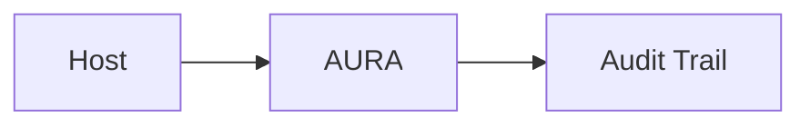
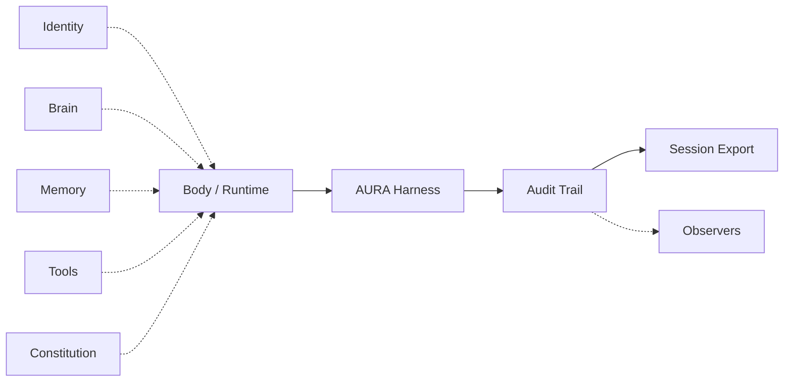

<div align="center">


<br>

**AURA Harness - A runtime coat for agent loops — audit, policy, and compliance export.**

Run your agent on your env with your tools, AURA proves what happened and stops what shouldn't, without owning your loop or your credentials.

<br>

<div align="center">
  <a href="https://pypi.org/project/aura-harness/"></a>
  <a href="https://doi.org/10.5281/zenodo.22031863"></a>
  <a href="LICENSE"></a>
  <a href="https://github.com/arpahls"></a>
</div>

<br>

[Overview](#overview) ·
[How it works](#how-it-works) ·
[Architecture](#architecture) ·
[Quick start](#quick-start) ·
[Documentation](#documentation)

</div>

---

## Overview

**AURA Harness** wraps whatever runs your agent loop — a Python script, [Skillware](https://github.com/arpahls/skillware), LangGraph, or your own host. It does not replace the loop. It sits around it, records what happened, enforces your rules at tool boundaries, and exports a session you can ship to logs or compliance.

| | |
|---|---|
| **For** | Teams that need provenance, policy, and repeatable pipelines around agents |
| **Not** | A model runtime, orchestrator, or skill framework |
| **Pairs with** | Skillware (tools), any LLM host, your existing loop |

---

## How it works



Your **host** runs the loop. **AURA** attaches — policy at egress, causal logging. On close, the **audit trail** becomes session export (JSONL, summary, audit report).

→ [using-aura.md](docs/using-aura.md) · [skillware-integration.md](docs/skillware-integration.md)

---

## Architecture

Optional inputs feed the **body**; AURA wraps it; audit and export follow.



→ [architecture.md](docs/architecture.md) · [stack-position.md](docs/stack-position.md)

---

## Quick start

Requires **Python 3.10+**.

**Install from PyPI:**

```bash
pip install aura-harness
# optional Skillware host extra:
pip install "aura-harness[skillware]"
```

**Develop from source:**

```bash
git clone https://github.com/ARPAHLS/aura.git
cd aura
py -3.13 -m venv .venv && .venv\Scripts\activate   # Windows
pip install -e ".[dev]"
pytest
```

```python
from aura import agent, configure

configure()

ag = agent("acme/research-bot", policy_version="1")
with ag.session() as run:
    run.emit("turn.start", {"input": "hello"})
    run.emit("turn.end", {"tokens": 120})

print(run.exports)
```

CLI: `aura agent create`, `aura run`, `aura export`, `aura compare`, `aura export-otel`, `aura verify chain`.

→ [getting-started.md](docs/getting-started.md) · [examples/](examples/)

---

## Documentation

| Topic | Links |
| :--- | :--- |
| **Start** | [getting-started.md](docs/getting-started.md) · [concepts.md](docs/concepts.md) · [using-aura.md](docs/using-aura.md) |
| **Integration** | [reference-tool-host-capstone.md](docs/guides/reference-tool-host-capstone.md) · [guides/aura-on-skillware.md](docs/guides/aura-on-skillware.md) · [skillware-integration.md](docs/skillware-integration.md) · [sequencer.md](docs/sequencer.md) |
| **Identity & audit** | [trust-paths.md](docs/trust-paths.md) · [outputs.md](docs/outputs.md) |
| **Compare & position** | [comparison.md](docs/comparison.md) · [ROADMAP.md](docs/ROADMAP.md) |
| **Contribute** | [CONTRIBUTING.md](CONTRIBUTING.md) · [Agent workflow](docs/contributing/ai_native_workflow.md) · [TESTING.md](docs/TESTING.md) · [PUBLISHING.md](docs/PUBLISHING.md) · [CHANGELOG.md](CHANGELOG.md) |

**Notes**

- **Experimental (alpha)** — API may change between minor releases until 1.0.
- **Wrap, don't replace** — your host owns the loop; AURA records and gates at boundaries you wire through `emit()` or `SkillwareHost`.
- **Security** — loaded skills and scripts run in your process; see [SECURITY.md](SECURITY.md).
- **Citation** — [CITATION.cff](CITATION.cff) · [DOI 10.5281/zenodo.22031863](https://doi.org/10.5281/zenodo.22031863) (Zenodo concept DOI)
- **Support** — [issues](https://github.com/ARPAHLS/aura/issues) · systems@arpacorp.net

---

<div align="center">

<br>

<br>
<sub>Developed and Maintained by <b>ARPA HELLENIC LOGICAL SYSTEMS</b></sub>
<br>
<sub>Support: systems@arpacorp.net</sub>

</div>
