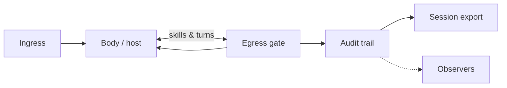

# Architecture (v0.3)

AURA is the **harness** around your host loop — ingress, policy, egress, record. Egress is a gate **inside** AURA, not a separate product name for the whole harness.

```
Ingress → Body ↔ Egress (policy) → Audit trail → Session export
                ↑                      ↓
           (tool execute)          Observers
```

## Data flow



→ Usage: [using-aura.md](using-aura.md) · Identity: [trust-paths.md](trust-paths.md)

## Core modules

| Module | Role |
|---|---|
| `aura/agents/` | Registry — ULID, `agent_ref`, ID trailer |
| `aura/core/session.py` | Sessions, approve + principal |
| `aura/core/spine.py` | Audit trail + hash chain |
| `aura/core/constraints.py` | Live policy on emit |
| `aura/core/conformance.py` | Declared vs observed |
| `aura/core/audit_report.py` | Findings + recommendations |
| `aura/membrane/` | Ingress context, egress guarded calls |
| `aura/sequencer/` | Prescriptive step pipelines |
| `aura/hosts/` | Skillware / mock skill host |
| `aura/observers/` | Parallel subscribers |
| `aura/exporters/` | JSONL summary, OTel JSONL |

## Extension surface (roadmap)

Type plugins, packaged observer presets (monitor, break — see [reference-tool-host-capstone.md](guides/reference-tool-host-capstone.md)), HTTP fleet API — see [ROADMAP.md](ROADMAP.md).

**Principle:** new capabilities emit or subscribe to the spine — core loop unchanged.
