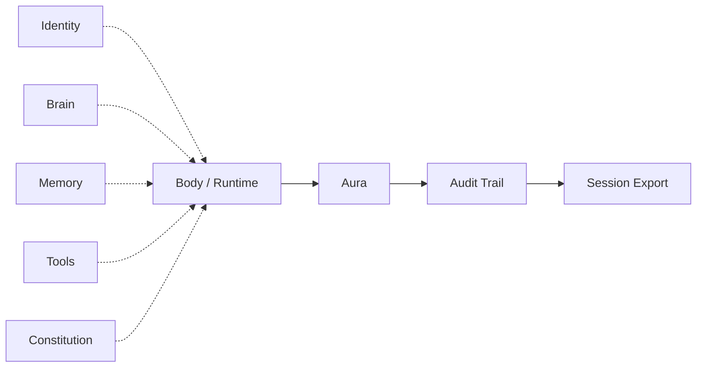

# AURA Architecture

> **Optional** — harness-centric view of the broader ARPA stack. Default path: [architecture.md](architecture.md) and [onboarding.md](onboarding.md).

How **AURA Harness** models a run.

---

## Flow

---

## Layers

| Layer | What it is | Shipped today |
| :--- | :--- | :--- |
| **Identity** | `agent_ref`, ULID `aura_id`, `ids` trailer | Agent registry + session trailer |
| **Brain** | Any model or reasoning substrate | Integration scripts under `integrations/` |
| **Memory** | Any retention backend | Adapter (roadmap) |
| **Tools** | Skills, MCP, HTTP APIs, Skillware | ToolHost + SkillwareHost reference coat |
| **Constitution** | Rules, guardrails, constraints on the agent profile | Constraint engine + manifest merge at bind |
| **Body / Runtime** | The active loop — Python script first | Your host; AURA wraps via SDK or ToolHost |
| **Aura** | Harness — hook, enforce, record | Session + membrane + observers |
| **Audit Trail** | Append-only causal log (`AuraEvent` stream) | Audit spine / JSONL + hash chain |
| **Session Export** | Deliverable on close — JSONL + summary + audit report + OTel | Shipped — see [outputs.md](outputs.md) |

---

## How to read this

**Inputs** (dotted) — none are required except something acting as a body. Bring any combination; adapters normalize over time.

**Body / Runtime** — the loop AURA wraps. Not owned by AURA.

**Aura** — runs alongside the body: checks constitution, appends to audit trail, never replaces the loop.

**Audit Trail** — official name for the live record. Code: `AuditSpine`. Every event has causal IDs.

**Session Export** — official name for the closed-session output. Feeds logs, SIEM, observability, or future bridges (Legacy, webhooks).

---

## vs full ARPA stack

| Full ARPA stack | AURA Harness |
| :--- | :--- |
| Identity → Soul → Body chain | Identity is an input alongside brain, memory, tools |
| Soul / SoulSig | Folded into **Constitution** + optional `ids` metadata |
| Neural System | **Tools** |
| Aura → Rooms / Legacy | Aura → Audit Trail → Export (bridges to Rooms/Legacy later) |
| Sovereignty | Security rules in **Constitution** or future adapter |

→ [README.md](../README.md) · [architecture.md](architecture.md)

---

## Principles

| | |
|---|---|
| Any subset of inputs | AURA stretches to what you bring |
| Wrap, don't replace | Body keeps the loop |
| Events before features | Audit trail is the foundation |
| Constitution is declarative | Rules compared on close (conformance) |
